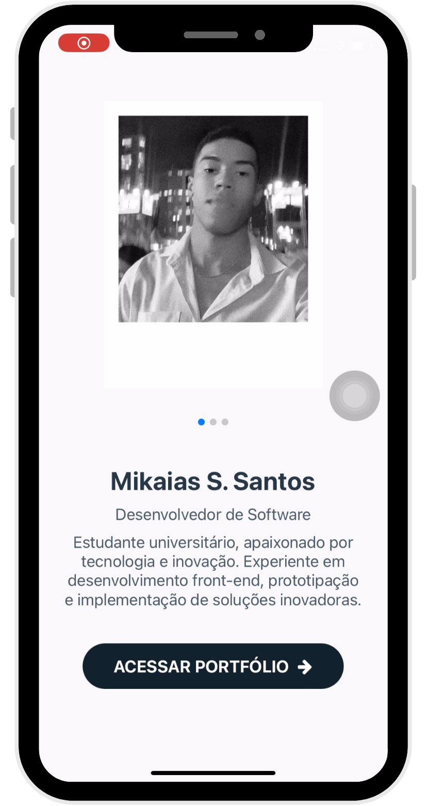
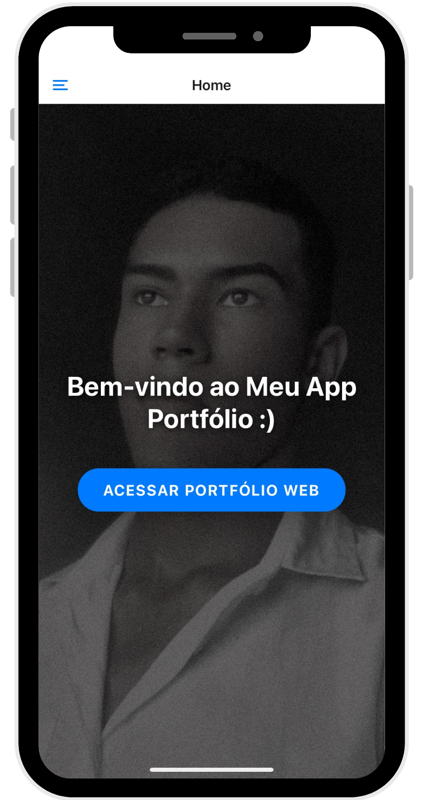
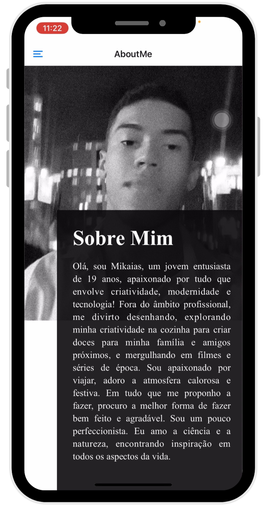
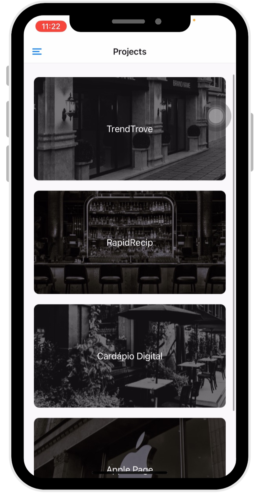

# Meu Portfólio - React Native

## 📜 Descrição

**Meu Portfólio** é o meu primeiro aplicativo desenvolvido com React Native. Este projeto foi criado como parte do meu aprendizado inicial em desenvolvimento mobile, e é uma aplicação que exibe informações sobre meus projetos, contatos e sobre mim, tudo em uma interface amigável e responsiva.

## 📱 Funcionalidades

- Tela de boas-vindas com navegação intuitiva
- Menu de navegação lateral com as principais seções:
  - Início
  - Sobre Mim
  - Contatos
  - Projetos
  - Perfil
- Integração com serviços de email, WhatsApp, LinkedIn e Instagram

## 🚀 Tecnologias Utilizadas

- [React Native](https://reactnative.dev/)
- [Expo](https://expo.dev/)
- [React Navigation](https://reactnavigation.org/)
- [React Native Vector Icons](https://oblador.github.io/react-native-vector-icons/)

## 📸 Capturas de Tela

  
  
  
  

## 🙏 Agradecimentos
Obrigado por visitar o meu código! Espero que você tenha achado interessante e útil. Se tiver alguma sugestão ou feedback, sinta-se à vontade para entrar em contato.

